# Supplementary Material

This directory contains additional charts for all experiments shown and referenced in our paper.

---

## Overall Queries per Second (QPS)

### Patch ID 1 (`#18502f99eb24f37d11e2431a89fd041cbdaea621`)

This chart is already included in the paper.

### Patch ID 2 (`#30d41c8102c36af7551b3ae77e48efbeb6d7ecea`)

### Patch ID 3 (`#3bb5c6b0c21707ed04f93fb30c654caabba69f06`)

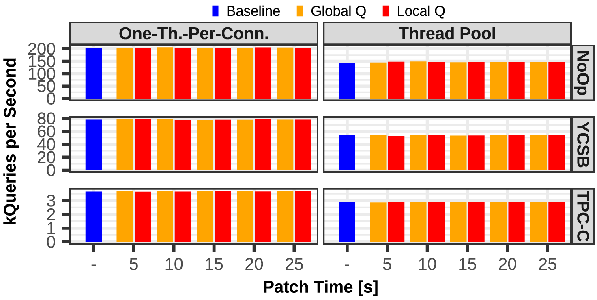

### Patch ID 4 (`#56402e84b5ba242214ff4d3c4a647413cbe60ff3`)

### Patch ID 5 (`#5b678d9ea4aa3b5ed4c030a9bb5e7d15c3ff8804`)

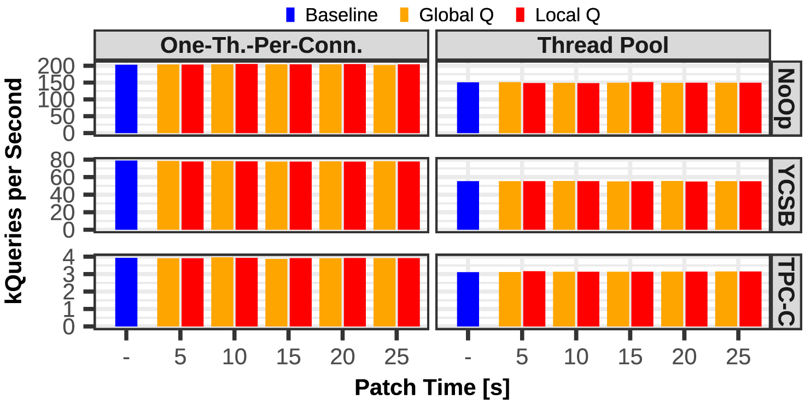

---

## Figure 5

### Patch ID 1 (`#18502f99eb24f37d11e2431a89fd041cbdaea621`)

This chart is already included in the paper.

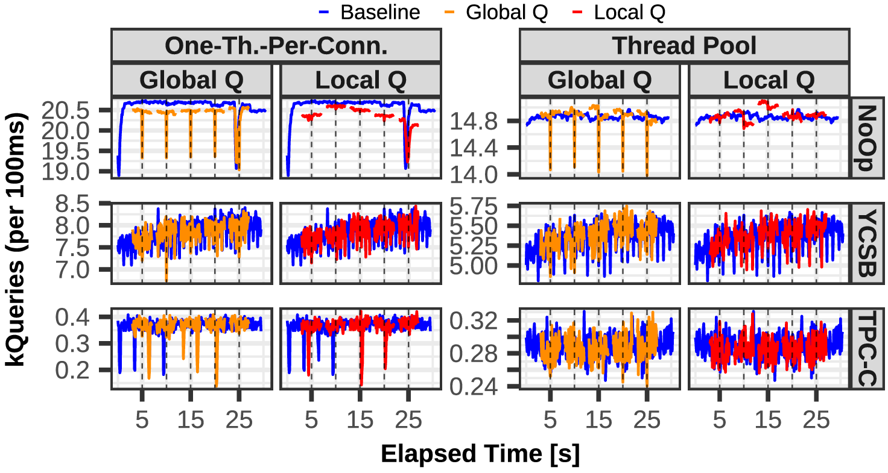

### Patch ID 2 (`#30d41c8102c36af7551b3ae77e48efbeb6d7ecea`)

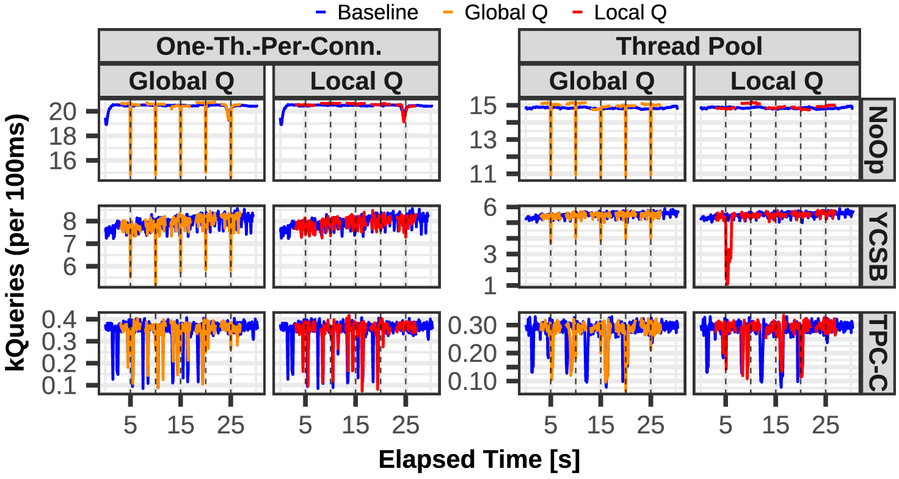

### Patch ID 3 (`#3bb5c6b0c21707ed04f93fb30c654caabba69f06`)

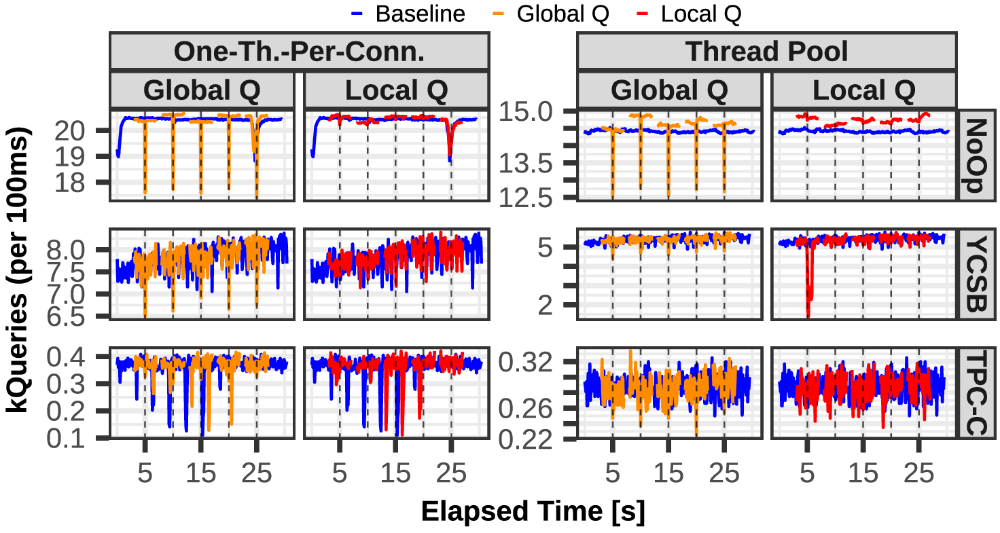

### Patch ID 4 (`#56402e84b5ba242214ff4d3c4a647413cbe60ff3`)

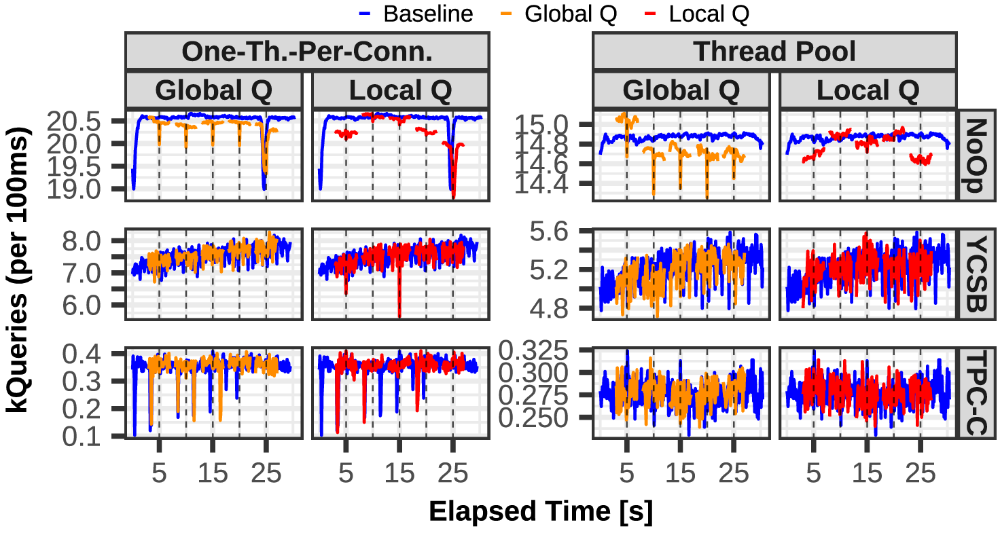

### Patch ID 5 (`#5b678d9ea4aa3b5ed4c030a9bb5e7d15c3ff8804`)

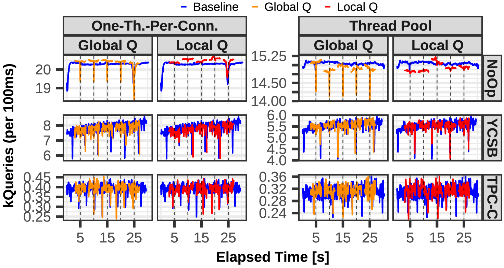

---

## Figure 6

### MariaDB (one-thread-per-connection)

The columns of patch ID 1 and 2 are already included in the paper.

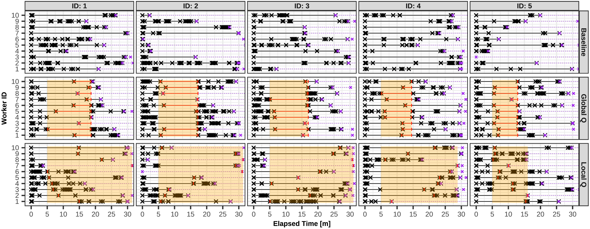

### MariaDB (thread pool)

This cannot be visualized using a thread pool. The mapping between query <-> worker <-> connection does not exists in this mode, which is required for this kind of chart.

---

## Figure 7

### Setup

Trigger patch application process every 100ms (but without loading a patch).

Each "patch ID" represents a different source code version for MariaDB. Thus, we performed this experiment for each version (but without ultimately loading the patch).

### MariaDB (thread pool)

### Version 1 (`#18502f99eb24f37d11e2431a89fd041cbdaea621`)

This chart is already included in the paper.

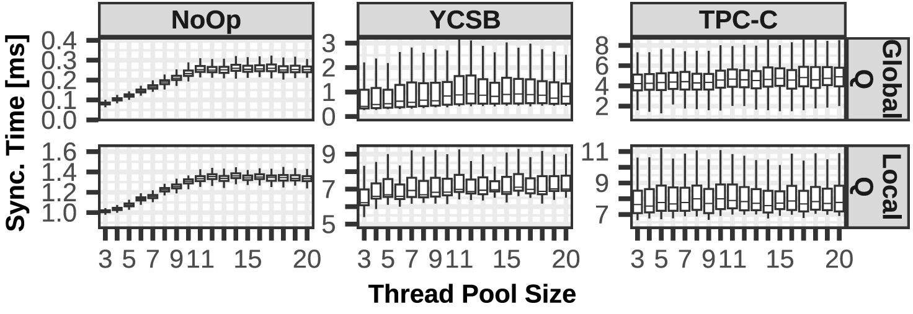

### Version 2 (`#30d41c8102c36af7551b3ae77e48efbeb6d7ecea`)

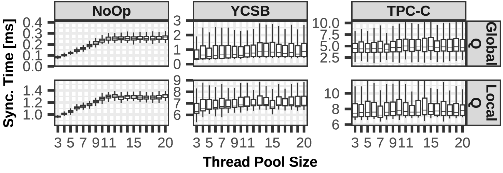

### Version 3 (`#3bb5c6b0c21707ed04f93fb30c654caabba69f06`)

### Version 4 (`#56402e84b5ba242214ff4d3c4a647413cbe60ff3`)

### Version 5 (`#5b678d9ea4aa3b5ed4c030a9bb5e7d15c3ff8804`)

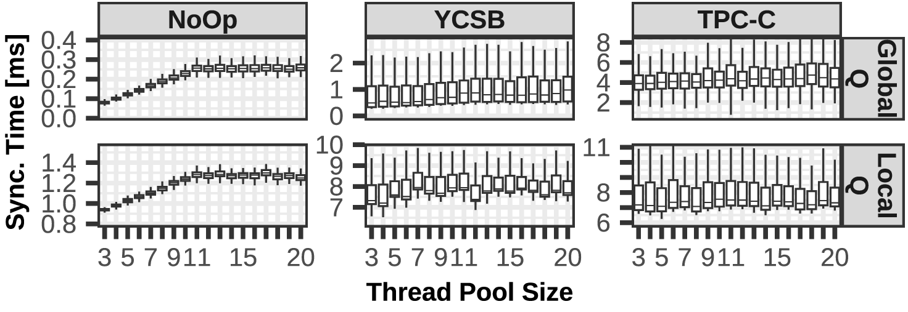

### MariaDB (one-thread-per-connection)

### Version 1 (`#18502f99eb24f37d11e2431a89fd041cbdaea621`)

### Version 2 (`#30d41c8102c36af7551b3ae77e48efbeb6d7ecea`)

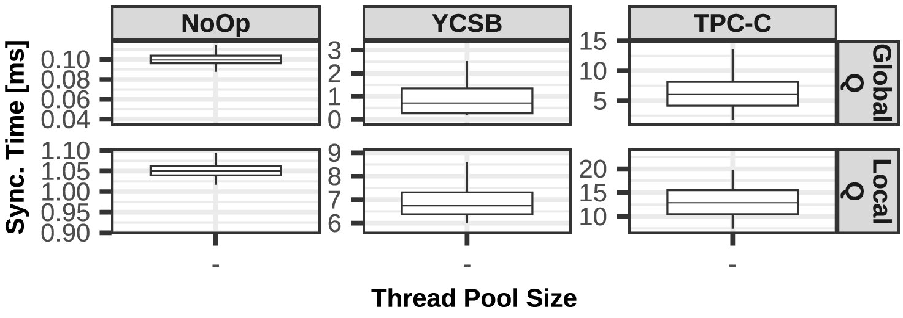

### Version 3 (`#3bb5c6b0c21707ed04f93fb30c654caabba69f06`)

### Version 4 (`#56402e84b5ba242214ff4d3c4a647413cbe60ff3`)

### Version 5 (`#5b678d9ea4aa3b5ed4c030a9bb5e7d15c3ff8804`)

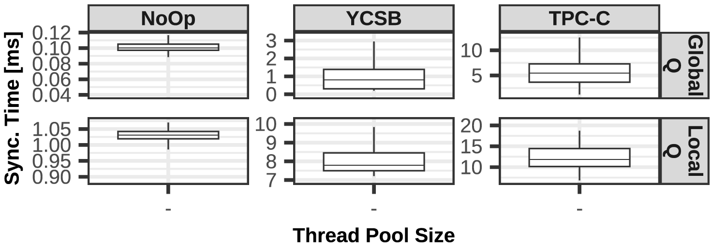

---

## Figure 8

Data from Figure 6, but visualized as single latencies.

### MariaDB (one-thread-per-connection)

This chart is already included in the paper.

### MariaDB (thread pool)

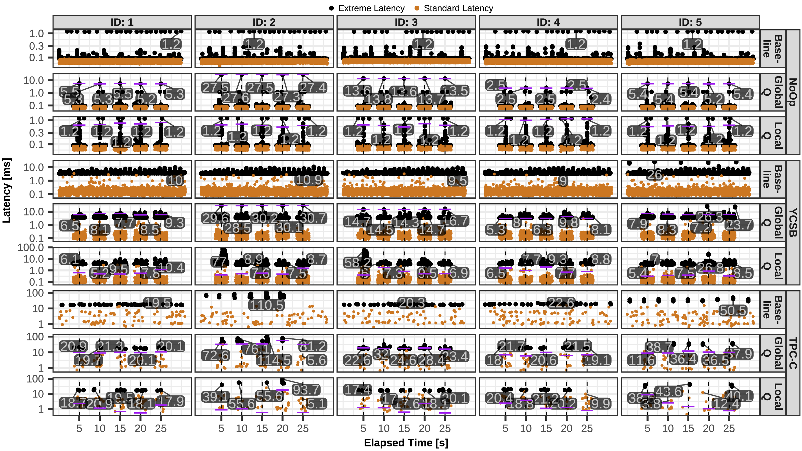

